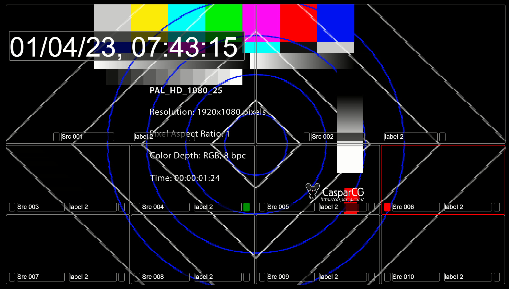

# VSM controlled - KALEIDO HTML OVERLAY

Generate you own HTML overlay for your video stream.
It supports as many kaleido outputs as you wish, and each output can have a different layout. Use localhost:3000/?output=xx to select output. The default setup are configured with 4 outputs.

## Installation
Download and run latest .exe release from:
https://github.com/olzzon/kaleido-ember-html-overlay/releases/latest




## Usage
### Using CasparCG and Decklink with Internal Keying support or NDI:

run "kaleido-ember-win-x64.exe" on your CasparCG machine.
Setup Decklink to use internal keyer (only some Decklink cards support this)

Play command for Decklink SDI keyer:
```
play 1-11 [html] http://localhost:3000/?output=1
````

Play command for NDI overlay:
```
play 1-10 [NDI] "ndi://TRICASTER-MACHINE/Tricaster Multiview 2"
play 1-11 [html] "http://localhost:3000/?output=1&ndi=1"
````


Calling layout from Lawo Ember viewer:
run ember viewer.
Add connection:
localhost: 9000

### Changing layout
The htmloverlay-default-layout.json i located in your homefolder, and can be edited. Changes can be seen live either in CCG or in a browser using "http://localhost:3000/?output=xx"
The file will be crerated with defualt layout at first run.

Other layout examples are places in the "examples" folder

### Settings Format
The htmloverlay-settings.json file has this structure, and a default is created at first run.
* layoutFileList: List of layout files to be used, these can be recalled from Ember
* kaleidoOutputs: List of kaleido outputs, each output can have a different layout, and different global settings.

When referencing files in Windows remember to use double backslash, like this:
```
"C:\\Users\\ccg\\htmloverlay-tricasterA.json"
```

#### The filestructure is as follows:
```
{
    "layoutFileList": ["/Users/myuser/htmloverlay-layout1.json","/Users/myuser/htmloverlay-layout2.json"],
    "kaleidoOutputs": [
        {
            "globalSettings": {
                "fontFamily": "\"Helvetica Neue\", Helvetica, Arial, sans-serif",
                "borderWidth": "2px",
                "borderRadius": "5px"
            },
            "outputName": "Kaleido 1",
            "selectedLayout": 0
        },
        {
            "globalSettings": {
                "fontFamily": "\"Helvetica Neue\", Helvetica, Arial, sans-serif",
                "borderWidth": "2px",
                "borderRadius": "5px"
            },
            "outputName": "Kaleido 2",
            "selectedLayout": 0
        },
.....]
}

 ```

### Layout format:

After first run a default layout is created in the htmloverlay-default-layout.json file.
this can be edited, and copied to new files.

```
    "sources": [
        {
SOURCE ELEMENTS ARE LABELS AND TALLY FIELD WITHIN A SOURCE:
            "sourceElements": [
                {
CLOCK ELEMENTS MUST INCLUDE A clockTimeZone AND clockFormat:
                    "clockTimeZone": "Europe/Copenhagen",
                    "clockFormat": "dk",
                    "height": 150,
                    "width": 900,
                    "positionX": 10,
                    "positionY": 100,
                    "color": "#ffffff",
                    "fontSizePercentage": 110,
                    "backgroundColor": "#000000aa"
                },
LABEL ELEMENTS MUST INCLUDE A labelIndex (Ember label 1-4)
                {
                    "labelIndex": 0,
                    "height": 30,
                    "width": 200,
                    "positionX": 210,
                    "positionY": 490,
                    "color": "#ffffff",
                    "backgroundColor": "#000000aa"
                },
                {
                    "labelIndex": 1,
                    "height": 30,
                    "width": 200,
                    "positionX": 490,
                    "positionY": 490,
                    "color": "#ffffff",
                    "backgroundColor": "#000000aa"
                },
                {
                    "labelIndex": 2,
                    "height": 30,
                    "width": 20,
                    "positionX": 180,
                    "positionY": 490,
                    "color": "#ff0000",
                    "backgroundColor": "transparent",
TALLY INDEX MUST INCLUDE THE INDEX OF THE TALLY & COLOR IN THE TALLYCOLORS ARRAY:
                    "tallyIndex": 0
                },
                {
                    "labelIndex": 3,
                    "height": 30,
                    "width": 20,
                    "positionX": 700,
                    "positionY": 490,
                    "color": "#ff0000",
                    "backgroundColor": "transparent",
                    "tallyIndex": 1
                }
            ],
EMBER STATE INDEX IS THE INDEX OF THE EMBER STATE IN THE EMBER STATES ARRAY IN THE SOURCE, IF NOT SET, THE EMBER STATE WILL BE HIDDEN, THIS IS THE REFERENCE TO THE EMBER STATE
            "emberStateIndex": 0,
            "positionX": 1,
            "positionY": 2,
            "width": 952,
            "height": 532,
            "tallyColors": [
                "red",
                "green",
                "blue",
                "yellow"
            ]
        },
SECOND SOURCE:
        {
            "sourceElements": [
        
        ...
        ...
        ...

    ]
}
```

### Ember states
The ember states are the states that are sent from Ember to the htmloverlay, and can be used to change the layout.
The state are store in htmlOverlayEmberStates.json, this file is not meant for editing purposes and will only be read upon startup.

